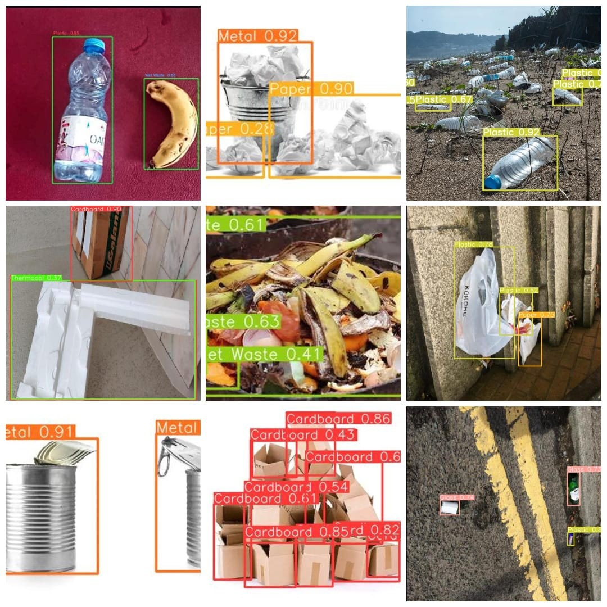
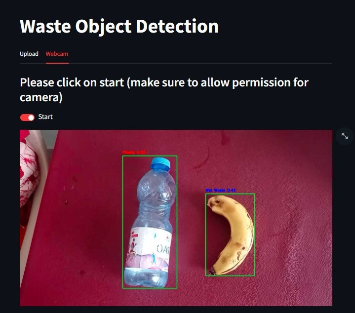
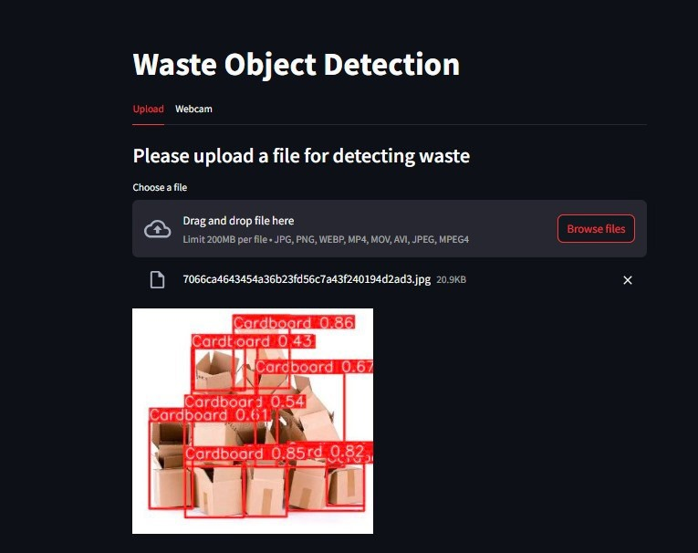

# Automated Waste Segregaion using Computer Vision

Developed an advanced waste segregation system using YOLOv5 for accurate identification and classification of various waste materials, enhancing recycling efficiency and environmental sustainability.

## Description

This project aims to detect and classify 7 classes of waste which include `paper` , `plastic` , `metal` , `cardboard` , `glass` , `thermocol` and `wet-waste`. The model has been trained on datasets which are a combination of already available datasets from roboflow and images collected and manually annotated using LabelImg which consisted a total of around 7000 images. The model achieves an accuracy of 85% after 50 epochs.

## Features

- Waste Classification: Detects and classifies seven types of waste: paper, plastic, cardboard, metal, thermocol, glass, and wet waste.
- High Accuracy: Achieved 85% accuracy after training for 50 epochs.
- Real-Time Detection: Capable of performing real-time waste detection using a webcam or video feed.

## Technologies Used

- Python
- Colab
- OpenCV
- NumPy
- Torch
- YOLOv5
- Streamlit

## Installation

Follow these steps to install and run the project:

1. **Clone the repository:**
   ```bash
   git clone https://github.com/Zzabi/Waste_Detection_YOLOv5.git
   cd Waste_Detection_YOLOv5
   ```
2. **Create and activate virtual environment:**
   ```bash
   conda create -n waste python=3.10.0
   conda activate waste
   ```
3. **Install the required dependencies:**
   ```bash
   pip install requirements.txt
   ```
4. Refer to colab_training.ipynb file to see dataset preparation using roboflow and training using YOLOv5

5. Install ffmpeg and adjust the path in main.py file ([how to install ffmeg](https://www.geeksforgeeks.org/how-to-install-ffmpeg-on-windows/))


## Usage

1. **Run the prediction script:**
   ```bash
   streamilt run main.py
   ```
## Screenshots

Here are some examples of the model in action:






